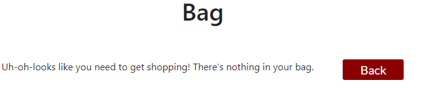

# The Rescuers

The Rescuers is a website for a fictional animal rescue charity, which is a remake of my first project, which was built using only HTML and CSS. This website is a newer iteration of this original website and as an eCommerce site, it allows the user to create an account, login, logout and edit their profile. The user can learn more about the purpose of the site on the home page, and can buy products from the charity to support their work. There is a list of products available, which the user is able to sort and filter. Once the user has decided what they wish to purchase, they are able to check their bag and make any required amendments to quantities of products or remove anything they no longer want. Once the user is happy and ready to purchase, they can manually input payment details, or use the ones they already have saved to their profile. The user can then pay using Stripe, and once their payment has been accepted, they will receive a confirmation email with their order number and a thankyou. 

## [Live Site](https://the-rescuers-p5.herokuapp.com/)

## Contents

- [The Rescuers](#the-rescuers)
- [UX Design](#ux-design)
  - [Strategy Plane](#strategy-plane)
  - [Scope Plane](#scope-plane)
  - [Structure Plane](#structure-plane)
    - [User Stories](#user-stories)
  - [Skeleton Plane](#skeleton-plane)
    - [Site Flow](#site-flow)
    - [Database Schema](#database-schema)
  - [Surface Plane](#surface-plane)
    - [Colour Scheme](#colour-scheme)
- [Agile Development Process](#agile-development-process)
- [Current Features](#current-features)
  - [Base Features](#base-features)
    - [Title](#title)
    - [Navbar (Logged in and out)](#navbar-logged-out)
    - [Bag Link](#bag-link)
    - [Footer](#footer)
  - [Home Page](#home-page)
    - [Jumbotron](#jumbotron)
    - [About us Section](#about-us-section)
    - [Home Reviews Section](#home-reviews-section)
  - [Reviews Page](#reviews-page)
    - [Reviews Section (Not Logged In)](#reviews-section-not-logged-in)
    - [Reviews Section (Logged in)](#reviews-section-logged-in)
    - [Add a Review Form](#add-a-review-form)
    - [Edit a Review Form](#edit-a-review-form)
    - [Delete a Review](#delete-a-review)
  - [Login Page](#login-page)
  - [Signup Page](#signup-page)
  - [Logout Page](#logout-page)
  - [Featured Residents Page](#featured-residents-page)
    - [Featured Residents Detail](#featured-residents-detail)
  - [Products List Page](#products-list-page)
    - [Products List Title](#products-list-title)
    - [Products List Search](#products-list-search)
    - [Products List Sort](#products-list-sort)
    - [Products List Products](#products-list-products)
  - [Product Detail Page](#product-detail-page)
    - [Product Detail Product](#product-detail-product)
    - [Product Detail Quantity](#product-detail-quantity)
    - [Product Detail Buttons](#product-detail-buttons)
  - [Bag](#bag)
    - [Empty Bag](#empty-bag)
    - [Products in Bag](#products-in-bag)
- [Future Development](#future-development)
- [Testing](#testing)
- [Deployment](#deployment)
- [Languages Used](#languages-used)
- [Technologies Used](#technologies-used)
- [Honourable Mentions](#honourable-mentions)
- [Credits](#credits)

## UX Design

### Strategy Plane
When creating a functional, informative website, a developer must consider all planes of development.

- Site Goal
	- The site goal is to allow users to learn about the charity and support the charity by making donations or purchasing pet products to support them.

- Target Audience
	- The target audience is primarily animal lovers, who wish to support charities.

- User Requirements
	- The User must be able to learn about the site and its' purpose.
	- The User must be able to sign up and log in.
	- The User must be able to log out.
	- The User must be able to view, add, edit and delete their reviews, as well as viewing others.
	- The User must be able to view products.
	- The User must be able to select the products they want to have.
	- The User must be able to pay for the products they want.
	- The User must be able to receive an order confirmation email once they have purchased a product.
	

| Opportunity                                            | Importance | Viability/Feasibility |
| ------------------------------------------------------ | ---------- | --------------------- |
| Home page- Content                                     | 5          | 5                     |
| Nav Bar                                       	 | 5          | 5                     |
| Review Page- Add a review                              | 4          | 4                     |
| Review Page- Edit a review                             | 4          | 4                     |
| Review Page- Delete a review                    	 | 4          | 4                     |
| Featured Residents Page                                | 4          | 4
| Products Page         				 | 5          | 5                     |
| Products Page - Price details        			 | 5          | 4                     |
| Products Page - Review details                 	 | 4          | 4                     |
| Product sort function                         	 | 3          | 4                     |
| Product filter function         			 | 3          | 4                     |
| Product detail page      				 | 4          | 4                     |
| Bag icon link in header         			 | 4          | 5                     |
| Adjust quantity buttons    				 | 4          | 4                     |
| Remove item button     				 | 4          | 4                     |
| Bag icon label                        		 | 3          | 4                     |
| Details of each product showing in bag		 | 4	      |	4		      |
| Checkout link from bag				 | 5          | 5                     |
| Payment details form					 | 5          | 5                     |
| Use saved payment details checkbox			 | 4          | 4                     |
| Stripe						 | 5          | 4                     |
| Email setup						 | 4          | 5                     |
| Add user profile					 | 4          | 4                     |
| Login functionality					 | 5          | 5                     |
| Logout functionality					 | 5          | 5                     |
| Edit profile details					 | 4          | 4                     |
| ----------------------------------------               | ----       | ----                  |
| Totals:25                                              | 110        | 113                   |

The viability score is higher than the importance score, so I should be able to implement all of the above features. These scores were based on my skill level at the beginning of the project.

### Scope Plane
Assessing the scope of a website is based on the information gathered from forumlating a strategy. Using the target audience and the established website goals, the website requirements were set out.
- Content Requirements:
	- Login Page
	- Logout Page
	- Sign up Page
	- Home Page
	- Reviews Page
	- Products app
	- Shopping Bag app
	- Profile app
	- Checkout app

### Structure Plane
The requirements listed above were then organised and structured into different apps, all of which can be reused for future projects:
- Home app (including reviews page)
- Products app
- Accounts app (login/Signup functionality)
- Profile app (storing personal data, order data etc.)
- Bag app
- Checkout app (accessible from bag)

#### User Stories
User Stories were then created to guide the development process. Once I had established a list, I organised them into apps and noted which feature would serve to achieve the user story. These are listed below and were logged as Issues, sorted into Milestones and completed on my project board in Github.

Home
- As a new user...
	- I want to see what the purpose of the site is from the home page.
	- I want to be able to navigate to each part of the site easily.
- As a current user...
	- I want to easily return to the part of the site I require.
	- I want to easily leave a review for the product I choose.
	- I want to easily edit a review for the product I choose.
	- I want to easily delete a review for the product I choose.
  - I want to be able to see the residents of the shelter, and who I will be helping when I buy products.

Products
- As a new user...
	- I want to easily see the list of products.
- As a current user...
	- I want to be able to easily see the price of the products I choose.
	- I want to be able to easily see the reviews of the products I choose.
	- I want to be able to sort the products to suit my needs.
	- I want to be able to filter the products to suit my needs.
	- I want to be able to select the products I require and add them to my bag.

Bag
- As a new user...
	- I want to easily access my bag.
- As a current user...
	- I want to be able to adjust quantities of items in my bag.
	- I want to be able to remove items from my bag.
	- I want to be able to see at a glance how many items I have in my bag.
	- I want to be able to see the details of the products in my bag.

Checkout
- As a new user...
	- I want to be able to easily access the checkout area.
- As a current user...
	- I want to be able to add my details to the payment screen.
	- I want to be able to use my existing payment details from my profile
	- I want to be able to pay using Stripe.
	- I want to receive a confirmation email once my payment has been accepted.

Profile
- As a new user...
	- I want to easily create my profile.
- As a current user...
	- I want to be able to log in to my account.
	- I want to be able to log out of my account.
	- I want to be able to see and edit my account details when I want.

I decided to remove the below user stories from my development using the agile process:

### Skeleton Plane
A wireframe for the website was produced using a desktop version of Balsamiq in order to provide a clear image of what the website should look like.

#### Site Flow
Using Balsamiq, I then created a flow map showing what I would visualise as the user's journey through the website.

#### Database Schema
I created a visual representation of my databases in [Lucid Chart](https://www.lucidchart.com/).

- Health Stats
  - The Health Stats model is designed for the user to be able to store their weight, run distance and run time using the update stats form.
  - The user and date fields are stored on each instance automatically, the date being registered as the current date/time, and the user being registered as the current logged in user. I decided to set the date field to 'auto_now_add = True' so that the initial date would be registered, however it would not be overwritten once edited, as I felt it was important to keep the original date of registering the data.
  - The weight and run distance fields are both decimal fields, with a max digits limitation of 5 and 2 decimal places.
  - The run time field is a duration field. This was originally created as a time field, however this did not work as expected. If a user input the a time of 1:00, this would register as a time of 1am. I then changed the field to a duration field and this fixed the issue and worked as expected.
- Article
  - The article model is designed to be able to store articles for the website, and display them in a list on the homepage, with the full content of each article available in the subsequent article pages. This model can only be added to via the admin panel using the admin login, so that the site admin can control the information available to all users.
  - The title and topic fields are set as character fields because they should only include text.
  - The featured image field is set as a cloudinary field because I am using Cloudinary to host my images.
  - The content field is set as a text field because this is where the main content of the article is held.

### Surface Plane

#### Colour Scheme
I used [Coolors](https://coolors.co/) to establish a colour scheme to use for this project.
Coolors generates complimentary colour schemes based on the colour you initially choose. I began by choosing an earthy green colour 'tea-green' which is similar to the colour scheme of my original static project, and then allowed the program to generate complimentary colours.
The full colour scheme is listed in my base.css file.

## Agile Development Process
I used Github's issues functionality, and organised them into milestones, which can be found [here](https://github.com/BenD2525/the_rescuers_p5/milestones). I also organised my issues using my project board, found [here](https://github.com/users/BenD2525/projects/3), moving them between in progress and completed as and when. 

## **Current Features**

### Base Features
The below features are part of my base template, and as such are included on all pages.

#### **Title**
The title of the website, I used the bootstrap display class to clearly display this as the website's title, ensuring it is prominent on each page.

#### **Navbar(Logged In and Logged Out)**
The navbar is located in the top left corner of the website, it is set up as a burger menu which opens below the header bar with all links centered. According to the user's logged in status, the options will change. When logged out, 'login' and 'signup' will show, whereas if the user is logged in, 'my account' and 'logout' will show.

#### **Bag Link**
The bag link is located in the top right corner of the website, on the header bar. It provides a live snapshot of the user's bag. It displays both the number of items currently in the bag, and the current value of the bag.

#### **Footer**
The footer is located at the bottom of the page. It is fixed there so is always visible to the user wherever they are on the page. It features my name, alongside a Github icon which allows the user to navigate to my Github to view other projects. On the opposite side of the footer, I have included a link to the top of the page the user is on, which allows for easy navigation on the longer pages on mobile view.

### **Home Page**
The home page is the landing page for the website, and serves to tell the user what the website is about. It includes the jumbotron header which contains the title of the website, as well as a brief tagline. Below this, the about us section is divided into 3 sections: Who are we? What do we do? and Who would you be helping? Below this, there is a link to the reviews section which allows the user to see reviews of the website.

#### **Jumbotron**
The jumbotron is at the top of the home page and sets out the purpose of the website to the user. It has a background image with leaves on which reflects the green values of the charity.

#### **About us Section**
The about us section tells the user about the charity in 3 sections: 
- Who are we?
- What do we do? 
- Who would you be helping?

Each section sets out to answer the question at the title of the section, and the final section includes 3 images of dogs which are residents of the charity.

#### **Home Reviews Section**
The reviews section allows the user to access the reviews page, which is also available on the navbar. 

### **Reviews Page**
The reviews page serves as a repository of user-submitted reviews of the website and the charity. If the user is logged in, they are able to add a new review, edit or delete any of their previously submitted reviews. If the user is not logged in, they are unable to edit or submit any reviews.
Each review consists of a title, a description, an author, a created date and a last modified date. These are contained within the review model.

#### **Reviews Section (Not Logged In)**
The reviews section allows an anonymous user to read any submitted reviews in the reviews section.

#### **Reviews Section (Logged in)**
The reviews section allows a logged in user to submit a new review, or edit/delete one of their existing reviews. The options to edit or delete a review will only show if the user is the author of that review.

#### **Add a Review Form**
If a user clicks the 'add a review' button, they are presented with a form, formatted with crispy forms, which captures the title and review content in text boxes. The author and dates are all captured automatically. Once submitted, the entry is added to the Review model.

#### **Edit a Review Form**
If a user clicks the 'edit' button, they are presented with a form, formatted with crispy forms, which displays the current title and content of the review. Once edited and submitted, the review will be displayed with any edits applied. The last modified date will be updated to the date on which the review has been edited.

#### **Delete a Review**
If a user clicks the 'delete' button, they are presented with a screen asking them to confirm whether they would like to delete the review they have selected.

### **Login Page**
The login page features a login form using AllAuth and formatted with the crispy forms package.

Once the user logs in, they are redirected to the home page and a successful message shows.

### **Signup Page**
The Signup page features a signup form using AllAuth and formatted with the crispy forms package.

### **Logout Page**
The Logout page features a logout button which when clicked, logs the user out of the site.

### **Featured Residents Page**
The Featured Residents page allows the user to see a selection of dogs which are currently residents at the shelter. They can see their photos, names, descriptions, ages and favourite toys.

#### **Featured Residents Detail**
The Featured Residents detail shows all of the details of the Resident model in order. This allows the user to view the featured residents' details, this can be easily updated by the site admin when the featured residents change.

### **Products List Page**
The Products page is accessible from the navbar and allows the user to see all products that are available to purchase. All products are contained within the products model. The user is able to search for a keyword using the search bar, sort the product list in various ways and click on any of the products to see them in more detail.

#### **Products List Title**
The products list contains a title, which serves to introduce the user to the product list, as well as a short paragraph with some humour which echoes the website's conversational tone.

#### **Products List Search**
The products list also contains a search bar which allows the user to input a keyword. The product list view then takes the input and uses it as a query. It looks up the keyword in the product title or description, filters the products and returns any results as a new list.

#### **Products List Sort**
The products list also contains a sort functionality which allows the user to sort by name or price. According to the selection, the results are then sorted in order.

#### **Products List Products**
Below the sort and search functionality, the products are listed in either the default order (by product ID) or by the order in which they have been sorted. The products are displayed in large squares, with the background image being the product's image. Each square contains the product's name, price and acts as a hyperlink to the product detail page for that product.

### **Product Detail Page**
The Product Detail page displays the user's chosen product in further detail, and allows the user to see the product's description, adjust their requested quantities of the product, add the product to their basket or go back to the products list.

#### **Product Detail Product**
The product detail page displays the product title, description and price.

#### **Product Detail Quantity**
Below the product details, the user is able to adjust the quantity of the product that they may wish to add to their bag. The plus and minus buttons allow the user to adjust the quantity, and they are able to type in a number up to 99. If the user then decides to add the product to their bag, the quantity of the product required will be added to the bag.

#### **Product Detail Buttons**
Below the quantity adjuster, the add to bag button allows the user to add the product to their bag, or the back button will return them to the products list.

### **Bag**
The Bag allows the user to see what they will be paying for when they checkout. It can be accessed by the bag icon in the header and it displays a link to the checkout page. It also provides the user with the ability to edit their bag; update quantities and remove items. Alternatively, it displays a message encouraging the user to shop if there is nothing in their bag.

#### **Empty Bag**
The message below is displayed if the user accesses an empty bag.

#### **Products in Bag**
The bag displays the details of the products contained in it in table format. In each row, the product names, pictures and prices are displayed. At the end of the product details, there is the ability to adjust the quantity of items in the bag using the plus and minus buttons. Once the new quantity is selected, the user can update their bag by clicking the update button at the end of the row. Alternatively, they can click the remove button to remove the product from their bag.

## **Future Development**

## Testing
Details of all testing undertaken can be found [here](TESTING.md).

## Deployment

This project was deployed to Heroku after being developed in the GitPod environment.

Steps to deploy:

- For the live project, ensure that DEBUG = False in settings.py.
- Go to your Heroku project dashboard, and click on the 'Deploy' tab.
- Click on the Github icon 'connect to GitHub'.
- Login to your GitHub account if needed, then search for the repository you want to connect the site to.
- When it shows up below, click 'connect'.
- Next to 'Automatic deploys' choose the branch you'd like to deploy from. In most cases this will be 'main'.
- Click 'Enable Automatic Deploys' if you would like Heroku to deploy your code everytime you push it to the above branch.
- If you prefer to deploy manually, scroll down to 'Manual deploy', choose your branch, and click 'Deploy Branch'.
- Scroll back to the top, and once it's finished deploying, click 'Open app', on the top right side.

## **Languages used**
- Python
- HTML
- CSS
- Javascript

## **Technologies used**
- Django
- Django AllAuth
- Bootstrap
- Crispy Forms
- AWS
- Balsamiq
- Lucid Chart
- Unsplash (for images)
- ElephantSQL

## Honourable Mentions
- Slack
- Stack Overflow

## Credits
- Boutique Ado
  - Code Institute walkthrough project for guidance on implementing many features, including the product list, bag and checkout pages.
- [Balsamiq](https://balsamiq.com/) for creating the wireframes.
- [Bootstrap](https://getbootstrap.com/docs/4.4/getting-started/download/)
  - Version 4.4.1, CSS framework for building a responsive front end.
- [AWS](https://aws.amazon.com/)
  - Used to store static files and media.
- [GitHub](https://github.com/)
  - Used for version control throughout the build process.
  - GitHub Projects used to organise user stories and tasks.
  - Milestones were used to group user stories into sections.
- [Google Fonts](https://fonts.google.com/)
- Cripsy Forms for formatting all of my forms.
- General References
  - Stack Overflow
  - GeeksForGeeks
  - Django docs
  - Bootstrap Docs
  - W3Schools
- [Unsplash](https://unsplash.com/) for providing the images, specifically:
  - Nahil Naseer for the jumbotron image.
  - Justin Veenema, Marliese Streefland and Pauline Loroy for the images on the home page.
  - Angel Luciano, Victor Grabarczyk and my personal photos for the featured residents images.
- [Lucid Chart](https://www.lucidchart.com/)- used for the creation of the database schema table.