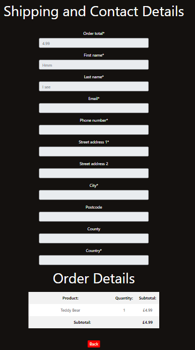

# The Rescuers

The Rescuers is a website for a fictional animal rescue charity, which is a remake of my first project, which was built using only HTML and CSS. This website is a newer iteration of this original website and as an eCommerce site, it allows the user to create an account, login, logout and edit their profile. The user can learn more about the purpose of the site on the home page, and can buy products from the charity to support their work. There is a list of products available, which the user is able to sort and filter. Once the user has decided what they wish to purchase, they are able to check their bag and make any required amendments to quantities of products or remove anything they no longer want. Once the user is happy and ready to purchase, they can manually input payment details, or use the ones they already have saved to their profile. The user can then pay using Paypal, and once their payment has been accepted, they will receive a confirmation email with their order number and a thankyou. 


## [Live Site](https://the-rescuers-p5.herokuapp.com/)

## Contents

- [The Rescuers](#the-rescuers)
- [Business Model](#business-model)
- [Web Marketing](#web-marketing)
  - [SEO](#seo)
    - [Keywords](#keywords)
  - [Facebook Business Page](#facebook-business-page)
  - [MailChimp](#mailchimp)
- [UX Design](#ux-design)
  - [Strategy Plane](#strategy-plane)
  - [User Acceptance Criteria and Prioritisation](#user-acceptance-criteria-and-prioritisation)
  - [Scope Plane](#scope-plane)
  - [Structure Plane](#structure-plane)
    - [User Stories](#user-stories)
  - [Skeleton Plane](#skeleton-plane)
    - [Site Flow](#site-flow)
    - [Database Schema](#database-schema)
  - [Surface Plane](#surface-plane)
    - [Colour Scheme](#colour-scheme)
- [Agile Development Process](#agile-development-process)
- [Current Features](#current-features)
  - [Custom 404](#custom-404-page)
  - [Toasts](#toasts)
  - [Base Features](#base-features)
    - [Title](#title)
    - [Navbar (Logged in and out)](#navbar-logged-out)
    - [Bag Link](#bag-link)
    - [Footer](#footer)
  - [Home Page](#home-page)
    - [Jumbotron](#jumbotron)
    - [About us Section](#about-us-section)
    - [Home Reviews Section](#home-reviews-section)
  - [Reviews Page](#reviews-page)
    - [Reviews Section (Not Logged In)](#reviews-section-not-logged-in)
    - [Reviews Section (Logged in)](#reviews-section-logged-in)
    - [Add a Review Form](#add-a-review-form)
    - [Edit a Review Form](#edit-a-review-form)
    - [Delete a Review](#delete-a-review)
    - [Contact Us](#contact-us-page)
  - [Login Page](#login-page)
  - [Signup Page](#signup-page)
  - [Logout Page](#logout-page)
  - [Featured Residents Page](#featured-residents-page)
    - [Featured Residents Detail](#featured-residents-detail)
  - [Products List Page](#products-list-page)
    - [Products List Title](#products-list-title)
    - [Products List Search](#products-list-search)
    - [Products List Sort](#products-list-sort)
    - [Products List Products](#products-list-products)
  - [Product Detail Page](#product-detail-page)
    - [Product Detail Product](#product-detail-product)
    - [Product Detail Quantity](#product-detail-quantity)
    - [Product Detail Buttons](#product-detail-buttons)
  - [Bag](#bag)
    - [Empty Bag](#empty-bag)
    - [Products in Bag](#products-in-bag)
  - [Checkout](#checkout)
    - [Shipping Details](#shipping-details)
    - [Paypal Payment Options](#paypal-payment-options)
    - [Thankyou Page](#thankyou-page)
    - [Payment Failed Page](#payment-failed)
  - [Profile](#profile)
    - [Current Details](#current-details)
    - [Edit Details](#edit-details)
    - [Order History](#order-history)
    - [Order Details](#order-details)
- [Future Development](#future-development)
- [Testing](#testing)
- [Deployment](#deployment)
- [Languages Used](#languages-used)
- [Technologies Used](#technologies-used)
- [Honourable Mentions](#honourable-mentions)
- [Credits](#credits)

## Business Model

Who:

I chose to adopt a B2C (Business to Customer) business model, which is normal for a smaller, local charity. Because of this, I will be selling direct to consumers from my website, and as such I will need to make payments as easy as possible. I have chosen Paypal as my payment method due to it being a world-renowned payments company which is well-trusted, secure and easy to use.

What:

I chose to sell physical products, which are ordered and then delivered to the user at their supplied shipping address on the checkout screen. I therefore decided it was key to include images with my products alongside the price, name and description in order to allow customers to feel secure in what they are buying.

How:

Based on my adoption of a B2C business model selling physical products, I decided to allow single payments only, and not a subscription.

### SEO

When creating an e-commerce website, a developer must consider how to ensure the website is easy to find through search engines. SEO is imperative at ensuring that the website is promoted well and visible to the target audience.

#### Keywords

For this project, I began with a list of topics:

- Animals
- Charity
- Toys

I then drilled down into these topics and collated some short-tail and long-tail phrases to ensure the visibility of my website to the target audience.

Short tail (Animals):

- Pets
- Dogs
- Cats

Short tail (Charity):
- Gifts
- Donate
- Support

Short tail (Toys):
- Cuddly toy
- Teddy bear
- Cuddly animals
- Fun toys

Long tail (Animals):
- Buy gifts for pets
- Gifts for dogs
- Presents for cats

Long tail (Charity):

- Support charity buy buying gifts
- Animal charity London
- Look after cats and dogs

Long tail (Toys):

- Cuddly toys for animals
- Presents for dogs and cats
- Fun toys for dogs and cats
- Toys for pets in London

I then used these keywords and phrases and incorporated them in my meta section in the head of my base template, which will be picked up by search engines. I have also ensured my title and introductory paragraph are in strong tags on my home page, to ensure these are prioritised by search engines.

I have also included a sitemap file from [XML Sitemaps](https://www.xml-sitemaps.com/) which allows search engines to crawl through my website structure and not miss any pages, aiding content discovery.

Lastly, I have added a robots.txt file to my root directory, which provides the location of the sitemap and advises any crawlers to miss out the accounts and profiles urls, as these hold sensitive data.

### Facebook Business Page

I also created a Facebook Business Page, the link to which I have included here:

[Facebook Business Page](https://www.facebook.com/profile.php?id=100089655048550)

As this may be taken down before this project is assessed, I have also included a screenshot as evidence:


This page has been created as a social media marketing strategy, in order to display the website to as many potential customers as possible. Social Media marketing was chosen because it's free, and has a large outreach for users of all ages. Animals are also very popular on the internet on sites such as Youtube, and the ethical side of my business resonates with social media users. Facebook was chosen as the initial marketing method because of the number of users and the target audience. Due to the Facebook demographic, the site will be advertised to user's of all ages, which is ideal for my site, as an animal charity is not specifically aiming at younger or older users.

### Mailchimp

I also created a Mailchimp account and used an embedded form on my home page, allowing users to subscribe to my mailchimp account. This will allow me to easily market my business through email marketing to the list of subscribers I have.


## UX Design

### Strategy Plane
When creating a functional, informative website, a developer must consider all planes of development.

- Site Goal
	- The site goal is to allow users to learn about the charity and support the charity by making donations or purchasing pet products to support them.

- Target Audience
	- The target audience is primarily animal lovers, who wish to support charities.

- User Requirements
	- The User must be able to learn about the site and its' purpose.
	- The User must be able to sign up and log in.
	- The User must be able to log out.
	- The User must be able to view, add, edit and delete their reviews, as well as viewing others.
	- The User must be able to view products.
	- The User must be able to select the products they want to have.
	- The User must be able to pay for the products they want.
	- The User must be able to receive an order confirmation email once they have purchased a product.
	

| Opportunity                                            | Importance | Viability/Feasibility |
| ------------------------------------------------------ | ---------- | --------------------- |
| Home page- Content                                     | 5          | 5                     |
| Nav Bar                                       	 | 5          | 5                     |
| Review Page- Add a review                              | 4          | 4                     |
| Review Page- Edit a review                             | 4          | 4                     |
| Review Page- Delete a review                    	 | 4          | 4                     |
| Featured Residents Page                                | 4          | 4
| Products Page         				 | 5          | 5                     |
| Products Page - Price details        			 | 5          | 4                     |
| Products Page - Review details                 	 | 4          | 4                     |
| Product sort function                         	 | 3          | 4                     |
| Product filter function         			 | 3          | 4                     |
| Product detail page      				 | 4          | 4                     |
| Bag icon link in header         			 | 4          | 5                     |
| Adjust quantity buttons    				 | 4          | 4                     |
| Remove item button     				 | 4          | 4                     |
| Bag icon label                        		 | 3          | 4                     |
| Details of each product showing in bag		 | 4	      |	4		      |
| Checkout link from bag				 | 5          | 5                     |
| Payment details form					 | 5          | 5                     |
| Paypal						 | 5          | 4                     |
| Email setup						 | 4          | 5                     |
| Add user profile					 | 4          | 4                     |
| Login functionality					 | 5          | 5                     |
| Logout functionality					 | 5          | 5                     |
| Edit profile details					 | 4          | 4                     |
| ----------------------------------------               | ----       | ----                  |
| Totals:24                                              | 106        | 109                   |


The viability score is higher than the importance score, so I should be able to implement all of the above features. These scores were based on my skill level at the beginning of the project.

### User Acceptance Criteria and Prioritisation

I then organised my user stories by the apps I need to create, and logged user acceptance criteria for each user story. Based on the importance scores above, I prioritised these user stories and sorted them into 'Must Have', 'Should Have' and 'Could Have'.


I decided that my one 'Could Have' user story- User is able to see the product's review under the product in the list' was not needed as a feature as it did not add enough to the user experience to warrant the time required in this time-constrained project.

### Scope Plane
Assessing the scope of a website is based on the information gathered from forumlating a strategy. Using the target audience and the established website goals, the website requirements were set out.
- Content Requirements:
	- Login Page
	- Logout Page
	- Sign up Page
	- Home Page
	- Reviews Page
	- Products app
	- Shopping Bag app
	- Profile app
	- Checkout app

### Structure Plane
The requirements listed above were then organised and structured into different apps, all of which can be reused for future projects:
- Home app (including reviews page)
- Products app
- Accounts app (login/Signup functionality)
- Profile app (storing personal data, order data etc.)
- Bag app
- Checkout app (accessible from bag)

#### User Stories
User Stories were then created to guide the development process. Once I had established a list, I organised them into apps and noted which feature would serve to achieve the user story. These are listed below and were logged as Issues, sorted into Milestones and completed on my project board in Github.

Home
- As a new user...
	- I want to see what the purpose of the site is from the home page.
	- I want to be able to navigate to each part of the site easily.
- As a current user...
	- I want to easily return to the part of the site I require.
	- I want to easily leave a review.
	- I want to easily edit a review.
	- I want to easily delete a review.
  - I want to be able to see the residents of the shelter, and who I will be helping when I buy products.

Products
- As a new user...
	- I want to easily see the list of products.
- As a current user...
	- I want to be able to easily see the price of the products I choose.
	- I want to be able to sort the products to suit my needs.
	- I want to be able to filter the products to suit my needs.
	- I want to be able to select the products I require and add them to my bag.

Bag
- As a new user...
	- I want to easily access my bag.
- As a current user...
	- I want to be able to adjust quantities of items in my bag.
	- I want to be able to remove items from my bag.
	- I want to be able to see at a glance how many items I have in my bag.
	- I want to be able to see the details of the products in my bag.

Checkout
- As a new user...
	- I want to be able to easily access the checkout area.
- As a current user...
	- I want to be able to add my details to the payment screen.
	- I want to be able to pay using Stripe.
	- I want to receive a confirmation email once my payment has been accepted.

Profile
- As a new user...
	- I want to easily create my profile.
- As a current user...
	- I want to be able to log in to my account.
	- I want to be able to log out of my account.
	- I want to be able to see and edit my account details when I want.


I decided to remove the below user stories from my development using the agile process:


### Skeleton Plane
A wireframe for the website was produced using a desktop version of Balsamiq in order to provide a clear image of what the website should look like.


As you will see from the wireframes, there were some style changes made during the development process, and the contact page was created later on in the development process.

#### Site Flow
Using Balsamiq, I then created a flow map showing what I would visualise as the user's journey through the website.


#### Database Schema
I created a visual representation of my databases in [Lucid Chart](https://www.lucidchart.com/).


### Surface Plane

#### Colour Scheme
I used [Coolors](https://coolors.co/) to establish a colour scheme to use for this project.
Coolors generates complimentary colour schemes based on the colour you initially choose. I began by choosing an earthy green colour 'tea-green' which is similar to the colour scheme of my original static project, and then allowed the program to generate complimentary colours.
The full colour scheme is listed in my base.css file.

## Agile Development Process
I used Github's issues functionality, and organised them into milestones, which can be found [here](https://github.com/BenD2525/the_rescuers_p5/milestones). I also organised my issues using my project board, found [here](https://github.com/users/BenD2525/projects/3), moving them between in progress and completed as and when. 

## **Current Features**

### Custom 404 page
This page is a page which shows whenever a 404 error occurs. It displays a funny image of a dog looking unimpressed, and a link to take the user back to the home page.


### Toasts
I have implemented toasts across the site in order to maintain communication with the user and provide feedback whenever they action a change in one of the databases.


### Base Features
The below features are part of my base template, and as such are included on all pages.

#### **Title**
The title of the website, I used the bootstrap display class to clearly display this as the website's title, ensuring it is prominent on each page.


#### **Navbar(Logged In and Logged Out)**
The navbar is located in the top left corner of the website, it is set up as a burger menu which opens below the header bar with all links centered. According to the user's logged in status, the options will change. When logged out, 'login' and 'signup' will show, whereas if the user is logged in, 'my account' and 'logout' will show.


#### **Bag Link**
The bag link is located in the top right corner of the website, on the header bar. It provides a live snapshot of the user's bag. It displays both the number of items currently in the bag, and the current value of the bag.


#### **Footer**
The footer is located at the bottom of the page. It is fixed there so is always visible to the user wherever they are on the page. It features my name, alongside a Github icon which allows the user to navigate to my Github to view other projects. On the opposite side of the footer, I have included a link to the top of the page the user is on, which allows for easy navigation on the longer pages on mobile view.


### **Home Page**
The home page is the landing page for the website, and serves to tell the user what the website is about. It includes the jumbotron header which contains the title of the website, as well as a brief tagline. Below this, the about us section is divided into 3 sections: Who are we? What do we do? and Who would you be helping? Below this, there is a link to the reviews section which allows the user to see reviews of the website.

#### **Jumbotron**
The jumbotron is at the top of the home page and sets out the purpose of the website to the user. It has a background image with leaves on which reflects the green values of the charity.


#### **About us Section**
The about us section tells the user about the charity in 3 sections: 
- Who are we?
- What do we do? 
- Who would you be helping?

Each section sets out to answer the question at the title of the section, and the final section includes 3 images of dogs which are residents of the charity.


#### **Home Reviews Section**
The reviews section allows the user to access the reviews page, which is also available on the navbar. 


### **Reviews Page**
The reviews page serves as a repository of user-submitted reviews of the website and the charity. If the user is logged in, they are able to add a new review, edit or delete any of their previously submitted reviews. If the user is not logged in, they are unable to edit or submit any reviews.
Each review consists of a title, a description, an author, a created date and a last modified date. These are contained within the review model.

#### **Reviews Section (Not Logged In)**
The reviews section allows an anonymous user to read any submitted reviews in the reviews section.


#### **Reviews Section (Logged in)**
The reviews section allows a logged in user to submit a new review, or edit/delete one of their existing reviews. The options to edit or delete a review will only show if the user is the author of that review.


#### **Add a Review Form**
If a user clicks the 'add a review' button, they are presented with a form, formatted with crispy forms, which captures the title and review content in text boxes. The author and dates are all captured automatically. Once submitted, the entry is added to the Review model.


#### **Edit a Review Form**
If a user clicks the 'edit' button, they are presented with a form, formatted with crispy forms, which displays the current title and content of the review. Once edited and submitted, the review will be displayed with any edits applied. The last modified date will be updated to the date on which the review has been edited.


#### **Delete a Review**
If a user clicks the 'delete' button, they are presented with a screen asking them to confirm whether they would like to delete the review they have selected.


### Contact Us Page
This page is accessible from the nav bar and allows the user to submit an enquiry to the website. The page displays a form which allows the user to provide their email, a title for their enquiry, and a text box in which they can submit the enquiry. Upon submitting the enquiry, the user will receive a successful enquiry pop up in their top right corner, and they will receive an email as acknowledgement of the enquiry being received. The email displays the details of the enquiry and advises the user of a timeframe in which they can expect an answer.


### **Login Page**
The login page features a login form using AllAuth and formatted with the crispy forms package.


Once the user logs in, they are redirected to the home page and a successful message shows.

### **Signup Page**
The Signup page features a signup form using AllAuth and formatted with the crispy forms package.


### **Logout Page**
The Logout page features a logout button which when clicked, logs the user out of the site.


### **Featured Residents Page**
The Featured Residents page allows the user to see a selection of dogs which are currently residents at the shelter. They can see their photos, names, descriptions, ages and favourite toys.

#### **Featured Residents Detail**
The Featured Residents detail shows all of the details of the Resident model in order. This allows the user to view the featured residents' details, this can be easily updated by the site admin when the featured residents change.


### **Products List Page**
The Products page is accessible from the navbar and allows the user to see all products that are available to purchase. All products are contained within the products model. The user is able to search for a keyword using the search bar, sort the product list in various ways and click on any of the products to see them in more detail.

#### **Products List Title**
The products list contains a title, which serves to introduce the user to the product list, as well as a short paragraph with some humour which echoes the website's conversational tone.


#### **Products List Search**
The products list also contains a search bar which allows the user to input a keyword. The product list view then takes the input and uses it as a query. It looks up the keyword in the product title or description, filters the products and returns any results as a new list.


#### **Products List Sort**
The products list also contains a sort functionality which allows the user to sort by name or price. According to the selection, the results are then sorted in order.


#### **Products List Products**
Below the sort and search functionality, the products are listed in either the default order (by product ID) or by the order in which they have been sorted. The products are displayed in large squares, with the background image being the product's image. Each square contains the product's name, price and acts as a hyperlink to the product detail page for that product.


### **Product Detail Page**
The Product Detail page displays the user's chosen product in further detail, and allows the user to see the product's description, adjust their requested quantities of the product, add the product to their basket or go back to the products list.

#### **Product Detail Product**
The product detail page displays the product title, description and price.


#### **Product Detail Quantity**
Below the product details, the user is able to adjust the quantity of the product that they may wish to add to their bag. The plus and minus buttons allow the user to adjust the quantity, and they are able to type in a number up to 99. If the user then decides to add the product to their bag, the quantity of the product required will be added to the bag.


#### **Product Detail Buttons**
Below the quantity adjuster, the add to bag button allows the user to add the product to their bag, or the back button will return them to the products list.


### **Bag**
The Bag allows the user to see what they will be paying for when they checkout. It can be accessed by the bag icon in the header and it displays a link to the checkout page. It also provides the user with the ability to edit their bag; update quantities and remove items. Alternatively, it displays a message encouraging the user to shop if there is nothing in their bag.

#### **Empty Bag**
The message below is displayed if the user accesses an empty bag.


#### **Products in Bag**
The bag displays the details of the products contained in it in table format. In each row, the product names, pictures and prices are displayed. At the end of the product details, there is the ability to adjust the quantity of items in the bag using the plus and minus buttons. Once the new quantity is selected, the user can update their bag by clicking the update button at the end of the row. Alternatively, they can click the remove button to remove the product from their bag.


### **Checkout**
The checkout displays the bag and allows the user to fill in their shipping details. If the user is signed in and has details already saved in their profile, the form will pre-fill with these details. The user is then able to pay via Paypal. In order to pay via Paypal, the user can log into the test account using the details provided and click 'pay'. Once payment is successful, the site will create an order and send a confirmation email to the e-mail address provided. After this, the user will be redirected to a thank you page.

#### **Shipping Details**
The below form is displayed which allows the user to input their shipping details. If the user is logged in and has their details saved to their profile, this form will be pre-filled, making it easier for the user to checkout. If the user clicks the 'check details' button, this will validate the details provided and let the user know if they are valid or not. If they are, the paypal payment options, below will become visible and the user can continue with checkout.


#### **Paypal Payment Options**
The below buttons are displayed which allow the user to pay via Paypal.


#### **Thankyou Page**
This page is displayed once the user has paid for their order- if the user tries to access this url without first being redirected from a successful order, this page will be replaced by the custom 404 page. I did originally only allow the user to access this page directly from the payment process, however I decided to change this so that the user can go back to this page if required after making an order.


#### **Payment Failed**
This page is displayed is the user encounters an error with Paypal and they are unable to pay for their order. The page displays an apology advising the user that their payment has failed, and also displays a toast with an error message. The button allows the user to go to their profile.


### **Profile**
The profile section is only available to logged in users, and will not display if a non-authenticated user attempts to access the url without logging in. Within the profile section, the user can see and edit their current contact and shipping details, and see any previous orders they have made. They can also click on any of the orders to see all of the information concerning the order.

#### **Current Details**
The below section displays the current contact and shipping details saved to the user's profile. If these are incorrect, the user is able to amend them.


#### **Edit Details**
If the user wishes to edit their details within the profile app, they can click the 'Update my Details' button, to allow them to amend their current details. Once any amendments have been made to the form, they can submit and the new details will be saved. The new details will also pull through to the checkout when the user next goes to pay for a product.


#### **Order History**
At the bottom of the user profile, there is a table which displays any past orders that the user has made. There is some limited information displayed in this table, however the user is able to click the 'order details' button next to any of the orders to see that order in more detail.


#### **Order Details**
If the user wishes to see a particular order in more detail, they can see the contact and shipping details, as well as the product details in this screen.



### **Payments**
All payments are handled by Paypal and require the user to have a login to the sandbox account in order to pay through the Paypal button. These details have been supplied alongside submission of this project. If the user would like to use a card to pay rather than their Paypal account, they have the option of 'Debit or Credit card'.

A test card that the user can use to checkout:

- Card Number: 4005519200000004
- Expiry Date: Any future date
- Security Code: 888

Billing details can be whatever the user wishes, as long as they match the validations required by Paypal (valid postcode format for example).

Any errors on Paypal's side are handled by the onError function in the checkout template. This is provided by Paypal, and I have set it to redirect to my payment failed template to ensure the user is aware of the payment failure.

## **Future Development**
For future development, I would like to develop the below features.
- Ability to save the details added to the order form to the user's profile.
- Functionality to enable guest checkout.
- Product reviews and ratings.
- Profile pictures.
- A blog which user's can comment on and like.

## Testing
Details of all testing undertaken can be found [here](TESTING.md).

## Deployment

The live site was deployed to [Heroku](https://dashboard.heroku.com) using the following steps:

Below are the steps I took to deploy the site to Heroku and any console commands required to initiate it.

### Create repository:

1. Create a new repository in GitHub, ticking the boxes for readme, and gitignore files, and clone it locally following [these instructions](https://docs.github.com/en/repositories/creating-and-managing-repositories/cloning-a-repository)
   - Clone my project, and run the following command in the terminal to install all the required libraries/packages at once:
     - `pip3 install -r requirements.txt`

### Create Heroku App:

The below works on the assumption that you already have an account with [Heroku](https://id.heroku.com/login) and are already signed in.

1. Create a new Heroku app:
   - Click "New" in the top right-hand corner of the landing page, then click "Create new app."
1. Give the app a unique name:
   - Will form part of the URL (in the case of this project, I called the Heroku app the-rescuers-p5)
1. Select the nearest location:
   - For me, this was Europe.
1. Add Database to the Heroku app:
   - Navigate to the Resources tab of the app dashboard. Under the heading "Add ons," search for "Heroku Postgres" and click on it when it appears.
   - Select "Hobby Dev - Free" from the "plan name" drop-down menu and click "Submit Order Form."
1. From your editor, go to your projects settings.py file and copy the SECRET_KEY variable. Add this to the same name variable under the Heroku App's config vars.
   - left box under config vars (variable KEY) = SECRET_KEY
   - right box under config vars (variable VALUE) = Value copied from settings.py in project.

### Creating Environmental Variables Locally:

1. In the top level of your directory, type `touch env.py` and add this to the .gitignore file.
2. From the Heroku app settings tab, click "reveal config vars" and copy the value of the variable DATABASE_URL. Add this value to a variable called DATABASE_URL in your create .env file:
   - `"DATABASE_URL"="databaseurl"`
3. From your projects settings.py file, copy the SECRET_KEY value and assign it to a variable called SECRET_KEY in your .env file
   - `"SECRET_KEY"="thisismysecretkey"` If you'd rather change this, you can generate a new one with [Djecrety](https://djecrety.ir/)
4. Add AWS_SECRET_ACCESS_KEY variable to .env file:

### Setting up setting.py File:

1. At the top of your settings.py file, add the following snippet immediately after the other imports:
   ```
       import os
       import dj_database_url
       if os.path.isfile('env.py'):
           import env.py
       SECRET_KEY = os.environ.get("SECRET_KEY")
       DEBUG = True
   ```
1. Delete the value from the setting.py DATABASES section and replace it with the following snippet to link up the Heroku Postgres server:

   ```
   DATABASES = {
   'default': dj_database_url.parse(os.environ.get("DATABASE_URL"))
   }
   ```

1. Tell Django to use AWS to store media and static files by placing this snippet into settings.py:

```
if 'USE_AWS' in os.environ:
    # Cache control
    AWS_S3_OBJECT_PARAMETERS = {
        'Expires': 'Thu, 31 Dec 2099 20:00:00 GMT',
        'CacheControl': 'max-age=94608000',
    }

    # Bucket Config
    AWS_STORAGE_BUCKET_NAME = 'the-rescuers-p5'
    AWS_S3_REGION_NAME = 'eu-west-2'
    AWS_ACCESS_KEY_ID = os.environ.get('AWS_ACCESS_KEY_ID')
    AWS_SECRET_ACCESS_KEY = os.environ.get('AWS_SECRET_ACCESS_KEY')
    AWS_S3_CUSTOM_DOMAIN = f'{AWS_STORAGE_BUCKET_NAME}.s3.amazonaws.com'

    # Static and media files
    STATICFILES_STORAGE = 'custom_storages.StaticStorage'
    STATICFILES_LOCATION = 'static'
    DEFAULT_FILE_STORAGE = 'custom_storages.MediaStorage'
    MEDIAFILES_LOCATION = 'media'

    # Override static and media URLs in production
    STATIC_URL = f'https://{AWS_S3_CUSTOM_DOMAIN}/{STATICFILES_LOCATION}/'
    MEDIA_URL = f'https://{AWS_S3_CUSTOM_DOMAIN}/{MEDIAFILES_LOCATION}/'
```

1. Under the line with BASE_DIR, link templates directly in Heroku via settings.py:

   - `TEMPLATES_DIR = os.path.join(BASE_DIR, 'templates')`

1. Within the TEMPLATES array, add `'DIRS':[TEMPLATES_DIR]` like the below example:

```
   TEMPLATES = [
       {
           …,
           'DIRS': [TEMPLATES_DIR],
           …,

        },
       },
   ]
```

1. Add allowed hosts to settings.py:

   - `ALLOWED_HOSTS = ["PROJECT_NAME.herokuapp.com", 'local host']`

1. Create a Procfile at the top level of the file structure and insert the following:

   - `touch Procfile` (the capital P is important!)
   - Inside that file, add `web: gunicorn PROJECT_NAME.wsgi`

1. Make an initial commit and push the code to the GitHub Repository.
   - `git add .`
   - `git commit -m "Initial deployment"`
   - `git push`

### Deploy the project

1. For the live project, ensure that `DEBUG = False` in settings.py
1. Go to your Heroku project dashboard, and click on the 'Deploy' tab
1. Next to 'Deployment method', choose the right one for you. I deplyed via Github so the instructions below are related to that.
1. Click on the Github icon 'connect to GitHub'
1. Login to your GitHub account if needed, then search for the repository you want to connect the site to.
1. When it shows up below, click 'connect'.
1. Next to 'Automatic deploys' choose the branch you'd like to deploy from. In most cases this will be 'main'.
1. Click 'Enable Automatic Deploys' if you would like Heroku to deploy your code everytime you push it to the above branch.
1. If you prefer to deploy manually, scroll down to 'Manual deploy', choose your branch, and click 'Deploy Branch'
1. Scroll back to the top, and once it's finished deploying, click 'Open app', on the top right side.

## **Languages used**
- Python
- HTML
- CSS
- Javascript

## **Technologies used**
- Django
- Django AllAuth
- Bootstrap
- Crispy Forms
- AWS
- Balsamiq
- Lucid Chart
- Unsplash (for images)
- ElephantSQL

## **Dependencies**
- asgiref==3.5.2
- boto3==1.26.22
- botocore==1.29.22
- dj-database-url==0.5.0
- Django==3.2.16
- django-allauth==0.41.0
- django-countries==7.2.1
- django-crispy-forms==1.14.0
- django-jsonify==0.3.0
- django-paypal==2.0
- django-render-block==0.9.2
- django-storages==1.13.1
- django-templated-email==3.0.1
- gunicorn==20.1.0
- jmespath==1.0.1
- jsonpickle==3.0.1
- oauthlib==3.2.2
- Pillow==9.3.0
- psycopg2==2.9.5
- python3-openid==3.2.0
- pytz==2022.6
- requests-oauthlib==1.3.1
- s3transfer==0.6.0
- sqlparse==0.4.3

## Credits
- Boutique Ado
  - Code Institute walkthrough project for guidance on implementing many features, including the product list, bag and checkout pages.
- [Balsamiq](https://balsamiq.com/) for creating the wireframes.
- [Bootstrap](https://getbootstrap.com/docs/4.4/getting-started/download/)
  - Version 4.4.1, CSS framework for building a responsive front end.
- [AWS](https://aws.amazon.com/)
  - Used to store static files and media.
- [GitHub](https://github.com/)
  - Used for version control throughout the build process.
  - GitHub Projects used to organise user stories and tasks.
  - Milestones were used to group user stories into sections.
- [Google Fonts](https://fonts.google.com/)
- Cripsy Forms for formatting all of my forms.
- General References
  - Stack Overflow
  - GeeksForGeeks
  - Django docs
  - Bootstrap Docs
  - W3Schools
- [Unsplash](https://unsplash.com/) for providing the images, specifically:
  - Nahil Naseer for the jumbotron image.
  - Justin Veenema, Marliese Streefland and Pauline Loroy for the images on the home page.
  - Angel Luciano, Victor Grabarczyk and my personal photos for the featured residents images.
- [Lucid Chart](https://www.lucidchart.com/)- used for the creation of the database schema table.
- Christian Brown for checking in on me while completing his own project and jumping on calls when we needed to vent!
- Sam Revanoor for helping me figure out why my JSON wasn't coming through correctly to my order_success view.
- Fran from CI London Community for helping me with Paypal implementation.