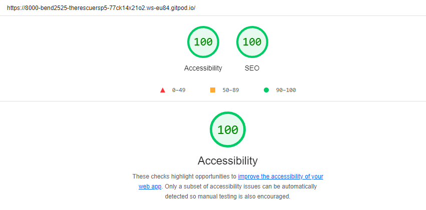
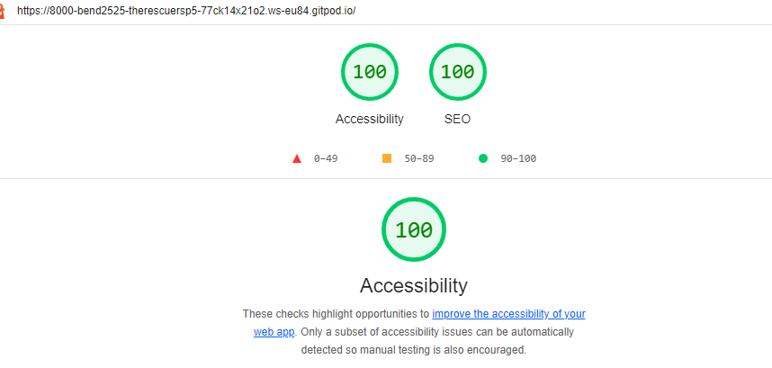
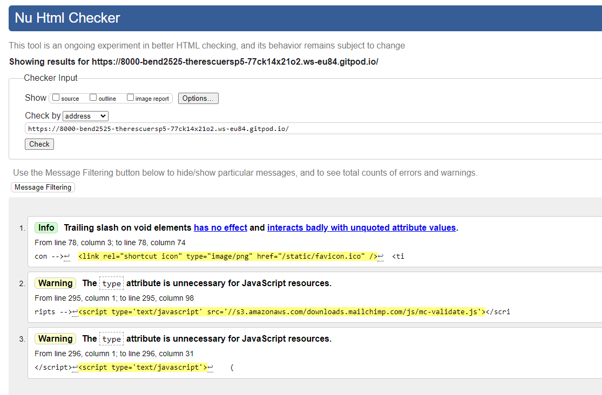
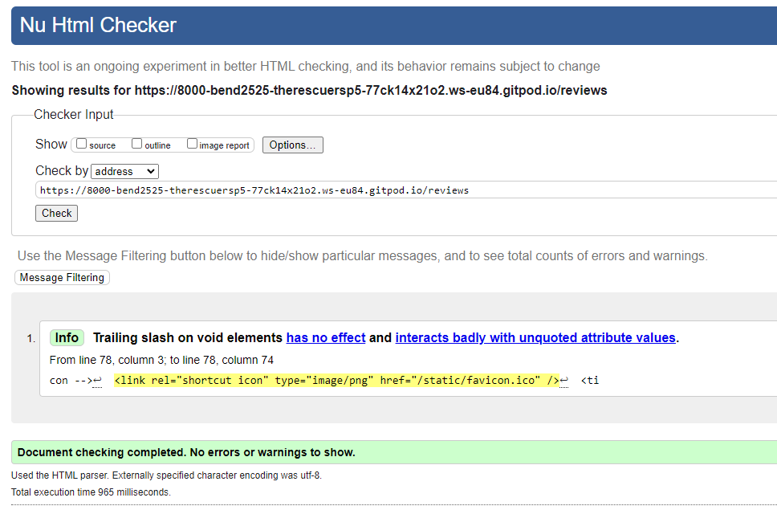

# Testing

[Return to README.md](README.md)

- [Bugs and Fixes During the Development Process](#bugs-and-fixes-during-the-development-process)
- [Lighthouse](#lighthouse)
  - [Mobile](#mobile)
  - [Desktop](#desktop)
- [Validators](#validators)
  - [HTML](#html)
  - [CSS](#css)
  - [Javascript](#javascript)
  - [Python](#python)
- [User Stories](#user-stories)

## Bugs and Fixes During the Development Process
- Content Wrapper
    - Issue - Content Wrapper was not covering entire screen on screens with low content.
    - Cause - Height was set to 100% (of content).
    - Solution - Added min-height of 100vw to content wrapper.
- Profile Display
    - Issue - Profile URL wasn't displaying correctly.
    - Cause - The profile did not have a slug field in the model.
    - Solution - I added in a slug field to the profile model, which fixed the issue.
- Profile formatting
    - Issue - Order history wasn't displaying correctly on smaller screens
    - Cause - The table was reponsive up until small screens, but was still too big.
    - Solution - I amended the CSS to display as a list instead of a table on small screens.
- Emails
    - Issue - Emails weren't sending correctly.
    - Cause - Email templates weren't saved in the correct location.
    - Solution - Email templates moved to the templates folder in root directory.
- Burger Menu
    - Issue - Burger Menu not working on screens with scripts.
    - Cause - Hadn't added block.super into postloadjs
    - Solution - Added block.super, which fixed the issue.
- Home Images
    - Issue - Images on the home page were not displaying.
    - Cause - There was an extra slash in front of the image url.
    - Solution - I removed this slash and the images displayed.
- Checkout
    - Issue - Order was not being created after successful payment.
    - Cause - The JSON data was not coming through to the order_success view in the correct format.
    - Solution - I added this code to the order_success view in order to decode the JSON before using it.  my_json = request2.decode('utf8').replace("'", '"')

## Lighthouse

### Desktop

When I first tested, my accessibility score was quite low, because I had forgotten to add alt tags to my links, which wouldn't have allowed screen-readers to pick them up efficiently. I added these in and re-ran the lighthouse report, which displayed an accessibility score of 100.

### Mobile

## Browser Compatability

Google Chrome, Microsoft Edge, Mozilla Firefox and Safari all display content and images correctly and all links work and open in new window.
This was tested on a laptop, PC, iPad, Iphone SE, Galaxy S8, Pixel 6 and a Motorola G9.

## Validators

### HTML

There are some warnings regarding the javscript in the html checker, however they don't affect the usability of the site and don't present any errors. All templates have been passed through the HTML validation with no errors showing. I have included two screenshots above as examples. There initially were errors due to the fact that I had been using buttons wrapped in anchor tags to move around the site. I have now removed these and replaced them with solely buttons with onclick attributes.

### CSS

No errors or warnings were found for my custom CSS.

### JavaScript

There are 3 scripts in my files, one located in base.html which is my function for setting the timeout of messages. There is another which holds the Paypal checkout logic in my checkout template, and another which is from mailchimp on my index.html page.

When posting each script into the [javascript validator](https://jsvalidator.com/)- there were no errors.

### Python

[Python Checker](https://www.pythonchecker.com) was used to test all python files. All efforts were made to make all code pep8 compliant, with the exception of the settings.py file, which Django state in their docs is okay to ignore should it make the code uglier or harder to read. There are some errors within the terminal where the line is too long, however when I have attempted to amend some of them (urls), they no longer work. So I have left them and accepted the error.

## User Stories

### As a new user I want to see what the purpose of the site is from the home page.
- On the home page the user can read the about us section which describes the site's purpose.

### As a new user I want to be able to navigate to each part of the site easily.
- There is a burger menu on the header of the site, in the top left corner which allows the user to navigate the site easily.

### As a new user I want to understand what I can do on the site.
- There is an about us section on the landing page which explains the site and what the user can do.

### As a current user I want to easily leave a review.
- There is a link to the reviews section on the navbar, and also a button link to the reviews page on the home page. If the user is not logged in, they are advised that they will only be able to add a review if they are logged in.

### As a current user I want to easily edit a review.
- Once the user has logged in, they can edit a review they have previously added. A button will display under their previously added reviews directing them to the edit review page. If the user is not logged in, they are advised that they will only be able to add a review if they are logged in.

### As a current user I want to easily delete a review.
- Once the user has logged in, they can edit a review they have previously added. A button will display under their previously added reviews directing them to the edit review page. If the user is not logged in, they are advised that they will only be able to add a review if they are logged in.

### As a new user I want to easily see the list of products.
- The user is able to access the products list by clicking on 'Products' from the nav bar. This will take the user to the products list, where they can see all of the products on offer.

### As a current user I want to be able to easily see the price of the products I choose.
- The user is able to clearly see the price of any product on the product list page, the price is clearly marked on the products which are arranged on the page.

### As a current user I want to be able to sort the products to suit my needs.
- The user is able to sort the products in price and name, ascending or descending.

### As a current user I want to be able to filter the products to suit my needs.
- The user is able to search for a keyword and the products will only display which have that word either in the title or description.

### As a current user I want to be able to select the products I require and add them to my bag.
- The user is able to click on a product and add a quantity of the product to their bag from the product detail page.

### As a new user I want to easily access my bag.
- The user can access their bag by clicking on the shopping cart icon in the top right corner of any screen.

### As a current user I want to be able to adjust quantities of items in my bag.
- The user is able to update quantities of the items in the bag by using the plus or minus buttons on the bag page.

### As a current user I want to be able to remove items from my bag.
- The user is able to remove items from the bag by using the remove button on the bag page.

### As a current user I want to be able to see at a glance how many items I have in my bag.
- The site displays the number of items in the bag along with the price next to the cart icon.

### As a current user I want to be able to see the details of the products in my bag.
- When clicking on their bag, the user is taken to a table which displays the full contents and details of products currently in their bag.

### As a new user I want to be able to easily access the checkout area.
- The user can access the checkout area when they have items in their bag, from the bag screen. If they try to access the checkout with nothing in their bag, they will be redirected to the products list.

### As a current user I want to be able to add my details to the payment screen.
- The user can fill out the order form on the checkout screen.

### As a current user I want to be able to pay using Paypal.
- The user can login to Paypal using the Paypal button and pay through Paypal.

### As a current user I want to receive a confirmation email once my payment has been accepted.
- The user receives a confirmation email to their provided email address once they have completed an order.

### As a new user I want to easily create my profile.
- The user can create a profile by accessing 'My Profile' from the navbar if logged in, and can fill out their default details.

### As a current user I want to be able to log in to my account.
- The user can log in to their account from the navbar, accessible from the burger menu.

### As a current user I want to be able to log out of my account.
- The user can log out from their account from the navbar, this option will only show if the user is already logged in.

### As a current user I want to be able to see and edit my account details when I want.
- The user can enter their profile under 'My Profile' then edit their profile using the 'Edit Profile' button.

## Manual Testing

### Forms
- Signup form
    - When trying to submit a blank form, user is provided with an error message asking them to fill out the form.
    - When trying to use something other than an email address in the email field, the user is provided with an error message advising them to provide an email in the correct format.
    - When trying to use an existing username, the user is provided with an error message asking them to use a different username.
    - When trying to leave the username blank, the user is provided with an error message asking them to provide a username.
    - When trying to leave the password blank, the user is provided with an error message asking them to provide a password.
    - When trying to leave the confirm password blank, the user is provided with an error message asking them to confirm their password.
    - When trying to use a different password in the confirm password field, the user is provided with an error message asking them to use the same password as the password field.
    - When trying to use a short password, the user is provided with an error message asking them to create a longer password.
- Login form
    - When trying to submit a blank form, user is provided with an error message asking them to fill out the form.
    - When trying to submit incorrect details on the form, the user is provided with an error message asking them to provide correct details.
- Contact Us form
    - When trying to submit a blank form, user is provided with an error message asking them to fill out the form.
    - When leaving any of the fields blank, user is provided with an error message asking them to fill out the relevant field.
    - When trying to use something other than an email address in the email field, the user is provided with an error message advising them to provide an email in the correct format.
- Order Form
    - When trying to submit a blank form, the user is provided with an error message stating that the form is invalid.
    - When trying to use something other than an email address in the email field, the user is provided with an error message stating that the form is invalid.
    - When leaving any of the fields blank, the user is provided with an error message stating that the form is invalid.
- Profile Form
    - No validations were used on this form, as I do not want to force users into populating and storing their own personal information on the site. This is particularly important when considering GDPR and the power consumers have to request deletion of information whenever they wish. If a user wishes to request this, they can submit an enquiry requesting this deletion. Unless the site owner has any reason to store their data (for an ongoing order for example), then they must delete it. The site owner is able to sign in as an admin user and delete any data which is not required.

### Links
All external links work correctly and the Github/Facebook links open in a new tab, to avoid the user leaving the website.

[Return to README.md](README.md)